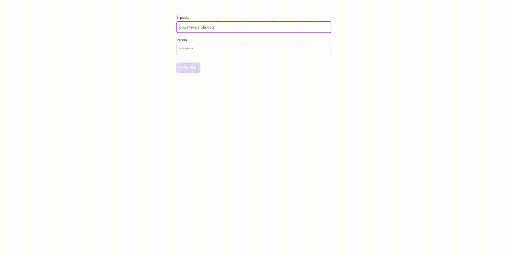

# 🔐 React Firebase Auth

Bu proje, **React**, **Firebase Authentication** ve **Redux Toolkit** kullanılarak geliştirilmiş modern bir kullanıcı kimlik doğrulama uygulamasıdır.  
Kullanıcılar e-posta ve parola ile kayıt olabilir, giriş yapabilir, profillerini güncelleyebilir ve parolalarını değiştirebilirler.

---

## Ekran Görüntüsü

## 🚀 Özellikler

- 🔑 E-posta & Parola ile kayıt olma ve giriş yapma
- 🔓 Oturumu kapatma (logout)
- 👤 Profil bilgilerini (ad-soyad, fotoğraf) güncelleme
- 🔒 Parola güncelleme
- ✉️ E-posta doğrulama gönderimi
- 🧠 Redux Toolkit ile global kullanıcı durumu yönetimi
- ⚙️ Firebase Authentication ile güvenli kimlik doğrulama

## 🧩 Kullanılan Teknolojiler

**React** -- Arayüz oluşturmak için

**Firebase Auth** -- Kimlik doğrulama servisi

**Redux Toolkit** -- Global state yönetimi

**Vite** -- Geliştirme ortamı ve build aracı

**Tailwind CSS / CSS** -- Modern, responsive arayüz tasarımı
